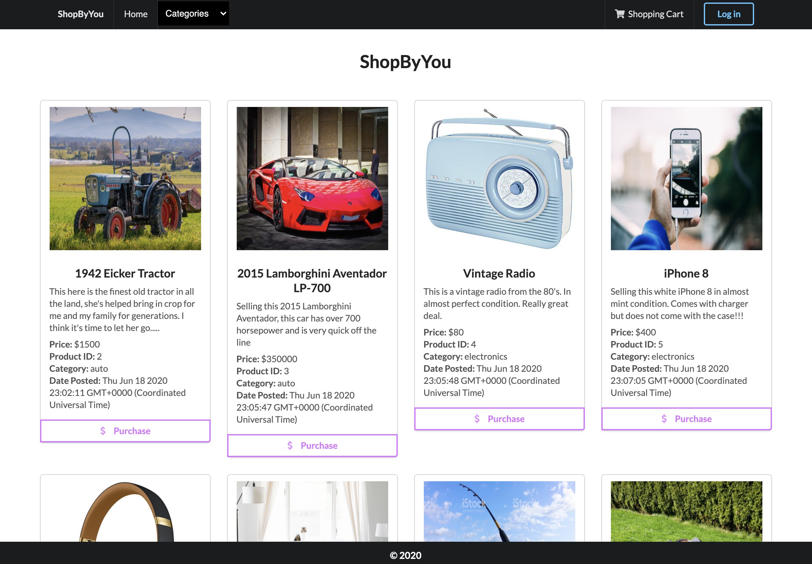
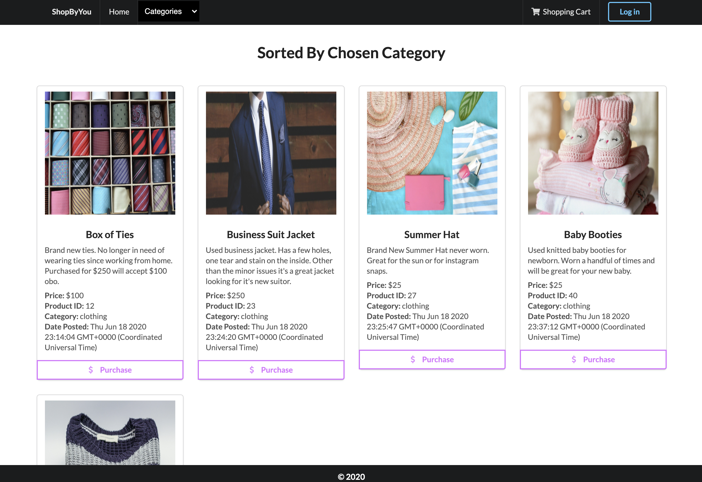
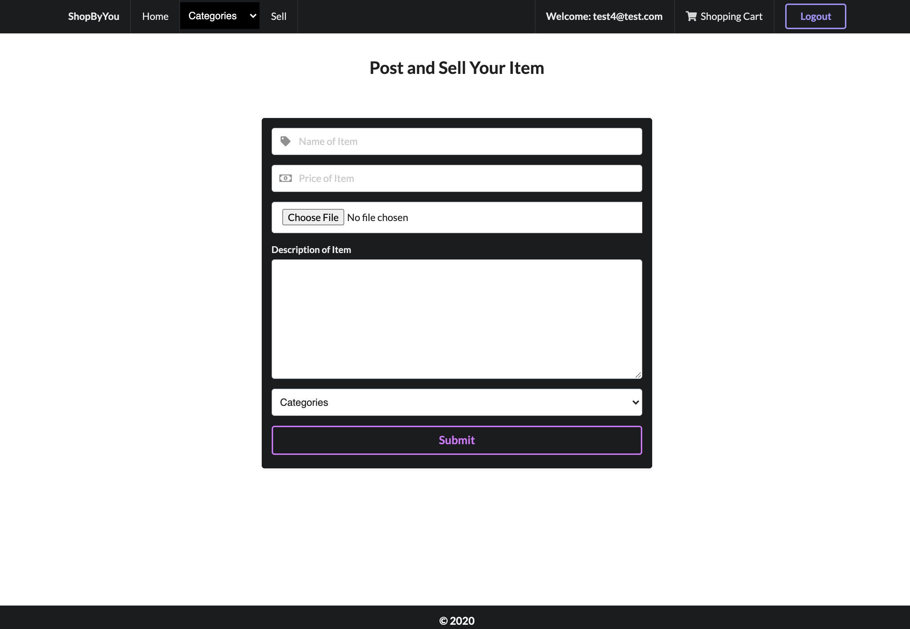
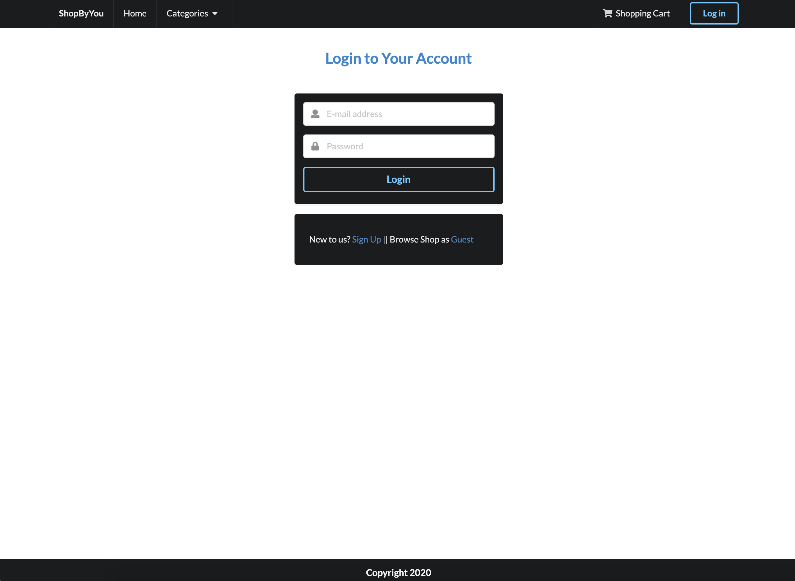
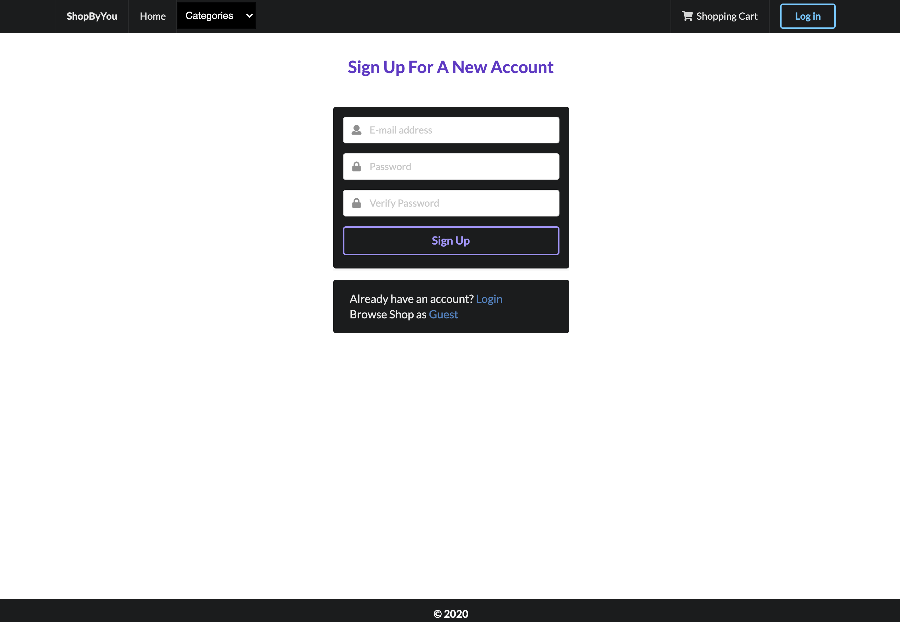

# ShopByYou
   

## Project Description

ShopByYou is a simple, hassle free way for users to shop and sell online. While shopping, a user can flip through the categories to find the products they are seeking with ease, and sellers can post listings based on criteria that will put their products on the shelves of our virtual storefront.

The application is deployed on Heroku for the server to run and function properly.   


## Deployment

[ShopByYou Heroku Application](https://young-earth-96498.herokuapp.com/)


## Table of Contents
  * [Installation](#installation)
  * [Usage](#usage)
  * [Project Technology](#project-technology)
  * [Screenshots of Application](#screenshots-of-application)
  * [Contributing Authors](#contributing-authors)

----
## Installation
To install, run following command in terminal:
  
```
npm i
```

  ## Usage

    ```
    AS AN Avid Shopper & Seller
    I WANT to be able to shop for and sell unique items
    SO THAT I can pass my unique items as well as buy other people’s items

    ```


----

## Project Technology
<details>
    <summary markdown="span">Click to expand Project Technology Details</summary>

Languages
- HTML
- CSS
- Javascript
- SQL

Libraries
- [jQuery](jquery.com)
- [Node.js](nodejs.org)

npm Packages
- [multer](https://www.npmjs.com/package/multer)
- [google-cloud](https://cloud.google.com/)
- [express](https://www.npmjs.com/package/express)
- [express-session](https://www.npmjs.com/package/express-session)
- [mysql2](https://www.npmjs.com/package/mysql2)
- [sequelize](https://www.npmjs.com/package/sequelize)
- [handlebars](https://www.npmjs.com/package/handlebars)
- [eslint](https://www.npmjs.com/package/eslint)
- [bcrypt](https://www.npmjs.com/package/bcrypt)
- [passport](https://www.npmjs.com/package/passport)
- [passport-local](https://www.npmjs.com/package/passport-local)

CSS Framework
- [Semantic UI](https://semantic-ui.com/)

Cloud Server
- [Heroku](heroku.com/)

</details>


## Screenshots of Application
<details>
    <summary markdown="span">Click to expand Screenshot Details</summary>


*Screenshot of Shop Page*


*Screenshot of Category Page*


*Screenshot of Sell Page*


*Screenshot of Sell Page*


*Screenshot of Home Page*

</details>


## Contributing Authors

[Andrew Greer](https://github.com/andrewpaulgreer)

[George Flores](https://github.com/lu-gflores)

[Josh Rivera](https://github.com/JRivera-31)

[Lindsey Lawson](https://github.com/lynseahoss)


